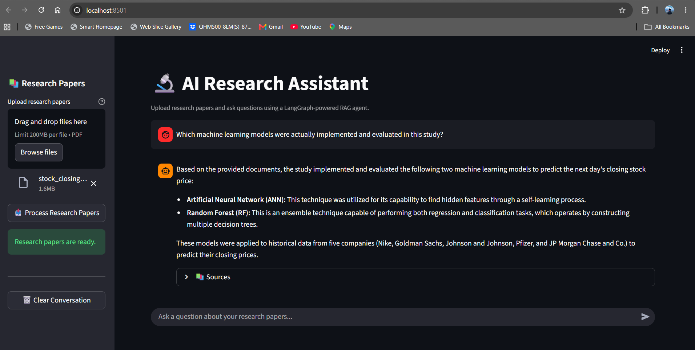

# 🔬 AI Research Assistant

> **Created by:** MANISH KUMAR

A conversational AI research assistant that allows users to upload research papers and ask questions about their documents using a **LangGraph-powered RAG (Retrieval-Augmented Generation) pipeline**.

The system combines **LangGraph, ChromaDB, HuggingFace embeddings, and Google Gemini** to retrieve relevant information from uploaded research papers and generate grounded answers.

## 🚀 See It in Action



The application provides a simple workflow:

**Upload research papers → Ask questions → Retrieve relevant information → Generate grounded answers**

Users can ask multiple questions about the uploaded papers during the same session.

---

## ✨ Features

- 📄 Upload multiple research papers in PDF format
- 📚 Support for up to **10 PDF files**
- 📦 Maximum file size of **20 MB per PDF**
- 🔎 Semantic search over uploaded documents
- 🧠 Local HuggingFace embeddings using `all-MiniLM-L6-v2`
- 🗄️ ChromaDB vector database
- 🔀 LangGraph-based research workflow
- 🧭 Intelligent query routing
- 📝 Automatic research-plan generation
- 🔍 Multiple search-query generation for each research step
- ⚡ Parallel document retrieval
- 🤖 Google Gemini-powered response generation
- 💬 Multiple questions in the same session
- 📚 Source and page references for retrieved information
- 🔐 API keys managed through environment variables

---

## 🏗️ Architecture

The application follows a multi-stage research workflow built with LangGraph.

```text
                    ┌──────────────────┐
                    │    User Query    │
                    └────────┬─────────┘
                             │
                             ▼
                 ┌──────────────────────┐
                 │     Query Router     │
                 │ research / general / │
                 │     more-info        │
                 └──────────┬───────────┘
                            │
                       Research
                            │
                            ▼
                 ┌──────────────────────┐
                 │   Research Planner   │
                 │   Generate 1–3 steps │
                 └──────────┬───────────┘
                            │
                            ▼
                 ┌──────────────────────┐
                 │   Query Generator    │
                 │   Generate 3 queries │
                 └──────────┬───────────┘
                            │
                            ▼
                 ┌──────────────────────┐
                 │    ChromaDB Search   │
                 │   Semantic Retrieval │
                 └──────────┬───────────┘
                            │
                            ▼
                 ┌──────────────────────┐
                 │ Retrieved Documents  │
                 │  + Source Metadata   │
                 └──────────┬───────────┘
                            │
                            ▼
                 ┌──────────────────────┐
                 │      Gemini LLM      │
                 │  Grounded Generation │
                 └──────────┬───────────┘
                            │
                            ▼
                 ┌──────────────────────┐
                 │     Final Answer     │
                 │    + Source Pages   │
                 └──────────────────────┘
```

---

## 🔄 How It Works

### 1. Upload Research Papers

Users upload one or more PDF research papers through the Streamlit interface.

Current limits:

- Maximum **10 PDFs**
- Maximum **20 MB per PDF**
- PDF format

### 2. Document Ingestion

When the user clicks **Process Research Papers**, the application:

1. Extracts text from uploaded PDFs.
2. Processes documents page by page.
3. Splits the text into smaller chunks.
4. Generates embeddings for the chunks.
5. Stores the embeddings in ChromaDB.

The application uses `sentence-transformers/all-MiniLM-L6-v2` for local document embeddings.

### 3. Query Routing

When a user asks a question, LangGraph analyzes the query and classifies it into one of three categories:

```text
research
more-info
general
```

Research questions continue through the RAG workflow.

General questions can be answered directly, while unclear questions can trigger a request for additional information.

### 4. Research Planning

For research questions, the system generates a research plan containing **1–3 research steps**.

For example:

```text
Question:
Which machine learning models were evaluated in the study?

Research Plan:
1. Identify the study referenced by the user.
2. Find the machine learning models implemented in the study.
3. Identify how the models were evaluated.
```

### 5. Search Query Generation

For each research step, the system generates **3 search queries** designed to retrieve relevant information from the uploaded documents.

### 6. Parallel Retrieval

The generated queries are processed through the researcher graph.

Each query performs semantic retrieval against ChromaDB. The retriever returns up to **6 documents per query**, after which the retrieved documents are combined and duplicate documents are removed.

### 7. Grounded Answer Generation

The retrieved documents are provided to the Gemini response model.

The response-generation prompt instructs the model to:

- Use only information contained in the retrieved documents.
- Avoid unsupported facts.
- Clearly state when the documents do not contain enough information.
- Provide a clear and readable answer.
- Mention source information when appropriate.

---

## 🧠 LangGraph Workflow

```text
START
  │
  ▼
Analyze & Route Query
  │
  ├── General ───────────────► General Response
  │
  ├── More Information ──────► Ask User
  │
  └── Research
          │
          ▼
    Create Research Plan
          │
          ▼
    Conduct Research
          │
          ▼
    More Steps Remaining?
       │           │
      Yes          No
       │           │
       ▼           ▼
Conduct Research  Final Response
```

The researcher subgraph handles:

```text
Research Step
     │
     ▼
Generate 3 Queries
     │
     ├──────────────┐
     ▼              ▼
 Retrieve        Retrieve
 Query 1         Query 2
     │              │
     └──────┬───────┘
            │
            ▼
       Retrieve Query 3
            │
            ▼
     Combined Documents
            │
            ▼
       Final Response
```

---

## 🛠️ Tech Stack

| Technology | Purpose |
|---|---|
| Python | Core programming language |
| LangGraph | Agent workflow and state management |
| LangChain | LLM and retrieval integration |
| Google Gemini | Query analysis, research planning, and answer generation |
| ChromaDB | Local vector database |
| HuggingFace | Local document embeddings |
| Sentence Transformers | `all-MiniLM-L6-v2` embedding model |
| PyPDF | PDF text extraction |
| Streamlit | Web-based user interface |
| Python-dotenv | Environment variable management |

---

## 📁 Project Structure

```text
AI-Research-Assistant/
│
├── .github/
│   └── workflows/
│       ├── integration-tests.yml
│       └── unit-tests.yml
│
├── .streamlit/
│   └── config.toml
│
├── data/
│   └── documents/
│       └── .gitkeep
│
├── docs/
│   └── AI-research-project-image-1.png
│
├── src/
│   ├── index_graph/
│   │   ├── configuration.py
│   │   ├── graph.py
│   │   └── state.py
│   │
│   ├── retrieval_graph/
│   │   ├── configuration.py
│   │   ├── graph.py
│   │   ├── prompts.py
│   │   ├── state.py
│   │   └── researcher_graph/
│   │       ├── graph.py
│   │       └── state.py
│   │
│   └── shared/
│       ├── configuration.py
│       ├── ingestion.py
│       ├── retrieval.py
│       ├── state.py
│       └── utils.py
│
├── static/
│
├── tests/
│   ├── integration_tests/
│   └── unit_tests/
│
├── .env.example
├── .gitignore
├── LICENSE
├── Makefile
├── README.md
├── app.py
├── langgraph.json
├── pyproject.toml
└── uv.lock
```

---

## ⚙️ Installation

### 1. Clone the repository

```bash
git clone https://github.com/manishkurps/AI-Research-Assistant.git
cd AI-Research-Assistant
```

### 2. Create a virtual environment

```bash
python -m venv .venv
```

On Windows:

```powershell
.venv\Scripts\activate
```

### 3. Install dependencies

```bash
pip install -e .
```

---

## 🔑 Environment Variables

Create a `.env` file in the project root.

Add your Google Gemini API key:

```env
GOOGLE_API_KEY=your_google_api_key_here
```

The repository contains `.env.example` as a template.

**Never commit your actual `.env` file or API key to GitHub.**

---

## ▶️ Run the Application

Start the Streamlit application:

```bash
streamlit run app.py
```

Then open:

```text
http://localhost:8501
```

---

## 📚 Using the Application

### Step 1 — Upload Papers

Use the sidebar to upload your research papers.

### Step 2 — Process the Papers

The application extracts text, creates document chunks, generates embeddings, and stores them in ChromaDB.

### Step 3 — Ask a Question

Use the chat input to ask a question about the uploaded research papers.

### Step 4 — Ask Follow-up Questions

Users can ask multiple questions during the same session.

Example questions:

```text
Which machine learning models were used?

What evaluation metrics were used?

Which model performed better?

What dataset was used?

What were the main conclusions?
```

---

## 📄 Upload Limits

| Limit | Value |
|---|---:|
| Maximum PDFs | 10 |
| Maximum size per PDF | 20 MB |
| Supported format | PDF |
| Questions per session | Multiple |

The application does not impose a fixed number of questions per session. Each question is processed through the research workflow and may use a Gemini API request.

---

## 💡 Example Questions

- What is the main objective of the study?
- Which machine learning models were implemented?
- What dataset was used?
- What evaluation metrics were used?
- Which model performed better?
- What methodology did the researchers follow?
- What are the main findings?
- What limitations were mentioned?
- What conclusions did the researchers reach?

---

## 🔐 Security and Data Handling

The project uses environment variables for API credentials.

The `.gitignore` file excludes:

- `.env`
- `.venv/`
- `chroma_db/`
- Uploaded PDF files
- Python cache files
- Generated package metadata

Research papers uploaded by users are **not stored in the GitHub repository**.

---

## ⚠️ Current Limitations

- The application currently focuses on PDF research papers.
- Google Gemini is required for the LLM-based workflow.
- A Gemini API request may be used for each research question.
- Embeddings are generated locally.
- ChromaDB is currently local to the application environment.
- Conversation history exists for the current application session.
- The application is currently designed primarily for local use.

---

## 🔮 Future Improvements

- Support for DOCX and additional document formats
- Streaming AI responses
- Persistent conversation memory
- User-specific document collections
- Cloud vector database support
- Authentication and multi-user support
- Improved citation formatting
- Research paper comparison
- Automatic research-paper summarization
- Export answers and research summaries
- Cloud deployment

---

## 🎯 Project Objective

Traditional research requires users to manually search through large research papers to locate specific information.

This project demonstrates how an AI-powered research workflow can automate this process by combining:

**Document Ingestion + Semantic Retrieval + Agentic Research Planning + LLM-based Generation**

The project focuses on building a practical AI application demonstrating **RAG, agentic workflows, state management, semantic retrieval, multi-query search, and grounded LLM generation**.

---


